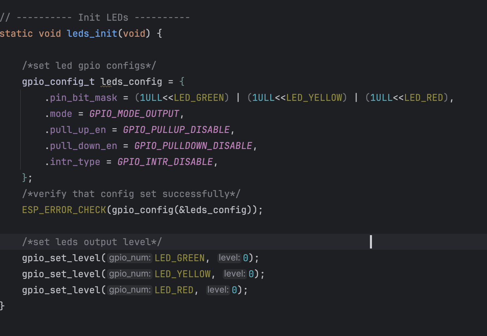

# 🛠️ C Assembler Project

This project is an **Assembler implementation in C**, developed as part of the course **20465 – 2025B (Open University of Israel)**.  
The project implements an assembler for a **custom assembly language**, designed for a **fictional hardware architecture**.
(<Screenshot 2025-09-15 at 15.22.04.png>)

