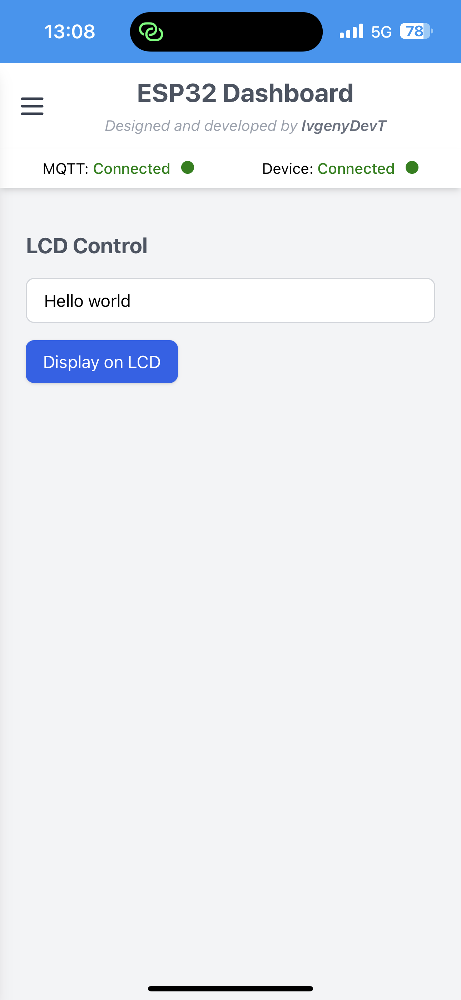

## 🌐 ESP32 IoT Cloud Control Dashboard

### 🧠 Overview

This project is a web-based control dashboard developed to manage and communicate with a custom-designed IoT gateway board, based on the ESP32-S2-U1-Mini chip.
The board itself was fully designed and programmed by me, and this dashboard serves as its main control and monitoring interface.

The dashboard is written in JavaScript, HTML, and CSS, with styling powered by TailwindCSS.
It is fully responsive — optimized for mobile devices as well as desktop browsers.


---


### ⚙️ Project Purpose

This web app acts as the primary interface between the user and the IoT device — a custom ESP32-S2 gateway that connects to the cloud via MQTT.
The system enables remote device management, firmware updates (OTA), Wi-Fi configuration, and direct hardware control — such as LCD display output and LED toggling.

🔗 See the IoT device firmware repository here:
ESP32 IoT Cloud Device Firmware

At this stage, the device doesn’t perform a specific sensor or actuator function (such as temperature measurement or motion detection).
Instead, it provides core infrastructure functions that are essential for any smart device:


-  **Connectivity (Wi-Fi & MQTT)**
-  **Available memory: 156 words**
- **Status monitoring**
- **Over-the-air firmware updates (OTA)**
- **Hardware interaction (LCD, LEDs)**
- **Multi-network memory management**

Future functionality (e.g., sensors, automation logic) can easily be added on top of this system.

---

### 🧩 System Architecture

```markdown
User (Web Dashboard)
        │
        ▼
  MQTT Broker (HiveMQ Cloud)
        │
        ▼
ESP32-S2 Custom IoT Gateway
        │
   ├── LCD Display
   ├── Status LEDs
   └── Wi-Fi / OTA / NVS Flash

```


The web dashboard communicates with the device via MQTT topics:
- Each button click on the dashboard publishes a message to a predefined topic.
- The ESP32 receives the message, executes the command (e.g., display text, toggle LED, start OTA).
- The ESP32 then publishes an acknowledgment or status update to a response topic.
- The dashboard listens and updates the UI accordingly.

⸻

### 🧠 Core Functionality Overview

| **Feature** | **Description** |
|--------------|----------------|
| MQTT Connection | Connects to HiveMQ Cloud over secure WebSocket (WSS) |
| Device Status | Displays live connection state and info (auto-refreshing) |
| LEDs Control | Toggle physical LEDs on the device (Yellow / Red / Green) |
| LCD Display | Send custom text strings to be displayed on the LCD screen |
| Wi-Fi Manager | Scan, connect, store, and manage multiple Wi-Fi networks |
| OTA Updates | Upload new firmware (.bin) remotely and trigger OTA process |
| Responsive UI | Mobile and desktop adaptive interface with TailwindCSS |


---

### 🏠 Dashboard Pages & Controls

Below is a detailed breakdown of each page, its functionality, and user interaction flow.


#### 🏡 1. Home Page

Purpose:

Main overview of the system’s state and connection.

Controls:
- Connect MQTT
Establishes a connection between the web dashboard and the cloud MQTT broker.
The client performs a secure WSS handshake, initializes subscriptions, and waits for incoming messages.

- Check Device Connection
Manually triggers a status check with the IoT device via MQTT.
The ESP32 replies with info like device name, firmware version, SSID, IP, MAC, and RSSI.

⚙️ Automatic Behavior:
- When the device powers on and connects to MQTT, its status automatically turns Online.

- When it goes offline, the dashboard instantly switches to Offline.

- The manual check button remains available to verify connectivity or refresh live metrics (like RSSI) without restarting.

Displayed Info:
- Device name
- Firmware version
- Wi-Fi SSID
- IP address
- MAC address
- RSSI (signal strength)


**📸 Example - main menu -**
<br><br>

<br><br>

**📸 Example - Home page before connection -**
<br><br>

<br><br>

**📸 Example - after MQTT connected, the app is trying to establish connection with the IoT device-**
<br><br>

<br><br>

**📸 Example - connection established between the app and the IoT device-**
<br><br>

<br><br>
---

#### 💡 2. LEDs Control Page

Purpose:

Control three physical LEDs on the ESP32 board.

Controls:

- Yellow LED

- Red LED

- Green LED

Each toggle sends an MQTT message such as:
``` bash
leds_toggle: "red led on"
```

The device updates the corresponding GPIO state and sends a confirmation message back.

**📸 Example - LEDs toggle page**
<br><br>

<br><br>

---

#### 🖥️ 3. LCD Display Page

Purpose:

Send text strings from the dashboard to be shown on the device’s LCD.

Controls:
- Input field — enter any text (max supported by your LCD).

- Display on LCD button — publishes an MQTT message with the text.

The ESP32 receives it and updates the LCD instantly.

**📸 Example - LCD control page**
<br><br>

<br><br>

---

#### 📶 4. Wi-Fi Management Page

Purpose:

Manage the device’s Wi-Fi connections, scan nearby networks, and switch access points.

Controls:
- Scan Wi-Fi button
Triggers a scan request via MQTT → The ESP32 scans nearby networks → The dashboard displays results dynamically.
- Connect button next to each network:
- If the network is saved in memory, it connects automatically.
- If it’s a new network, a modal popup appears for entering the password.
📸 Example Screenshot Placeholder (Wi-Fi Password Modal)

After successful connection:
- The new SSID is saved to NVS Flash, meaning the device will remember it and automatically reconnect after reboot.
- Multiple networks can be stored — the device will always connect to the strongest available on boot.
- During switching, the device temporarily disconnects before joining the new network.

If the password is incorrect or the connection fails:
- The device reconnects to the previous network.
- The invalid credentials are not saved.

**After pressing the scan button, the Wi-Fi scanning proccess is starting**

**📸 Example - Wi-Fi main page scanning**
<br><br>

<br><br>


**after Wi-Fi scan, the list with scanned Wi-Fi nets will be displayed**

**📸 Example - scanned available Wi-Fi list**
<br><br>

<br><br>

**while trying to connect to a new Wi-Fi for the first time, password and ssid are required**

**📸 Example - new Wi-Fi connection screen**
<br><br>

<br><br>

**after inserting password and ssid and pressing the connect button, the connection process will start**

**📸 Example - connecting to new Wi-Fi**
<br><br>

<br><br>


**if there is an error, a message with the relevant error should be displayed**

**📸 Example - wrong password**
<br><br>

<br><br>

**if we try to connect to a Wi-Fi that already connected in the past, the connection proccess will start without requiring password and ssid**

**📸 Example - connecting to saved Wi-Fi net**
<br><br>

<br><br>


**📸 Example - Wi-Fi connected successfully**
<br><br>

<br><br>
⸻

#### 🔄 5. OTA Update Page

Purpose:

Perform secure over-the-air (OTA) firmware updates remotely.

How it works:
	1.	Place a compiled .bin firmware file in the /firmware/ directory of your GitHub-hosted files.
	2.	Select it from the dropdown list in the dashboard.
	3.	Click Start OTA.

The dashboard sends an MQTT command with the firmware URL.
The ESP32 performs an HTTPS request, validates the SSL certificate, downloads the binary, and writes it to flash memory.

During the update:

- The dashboard displays real-time progress and status messages via MQTT.

- The ESP32 logs and publishes messages like:

```bash
    OTA_update_progress: 30%
    OTA_update_progress: restarting...
```
- Once complete, the ESP32 reboots, reconnects to MQTT, and reports the new firmware version on the Home page.


**📸 Example - OTA update page**
<br><br>

<br><br>

**choose the version to install from the available .bin files list**

**📸 Example - OTA firmware .bin files list**
<br><br>

<br><br>

**after chossing the required version, press OTA start button and the new version downloading and installing proccess will start**

**📸 Example - OTA update installing**
<br><br>

<br><br>

**after installation proccess done, the IoT device will reboot with the new installed version**

**📸 Example - OTA update installed successfully**
<br><br>

<br><br>

**now we can return to main page and see that the new version 6.0 installed**

**📸 Example - home page with new version**
<br><br>

<br><br>

| **Direction** | **Transport** | **Description** |
|----------------|---------------|-----------------|
| Dashboard → ESP32 | MQTT publish | Sends commands (toggle LED, start OTA, display LCD text, etc.) |
| ESP32 → Dashboard | MQTT publish | Sends acknowledgments, status, scan results, progress updates |
| ESP32 → Cloud | HTTPS | Fetches firmware for OTA updates |
| ESP32 ↔ Wi-Fi | Internal | Connects, scans, stores credentials in NVS Flash |


### 🛠️ Tech Stack
- Frontend: HTML5, CSS3 (TailwindCSS), Vanilla JavaScript (ES6 Modules)
- Protocol: MQTT over WSS (HiveMQ Cloud)
- Device Communication: ESP-IDF firmware over MQTT
- OTA Transport: HTTPS (secure SSL validation)
- Storage: NVS Flash (for Wi-Fi credentials)
- Hosting: GitHub Pages (static web app)

---

### 📱 Responsiveness

The app adapts to all screen sizes:
- ✅ Mobile-friendly (touch-optimized)
- ✅ Tablet-ready layout
- ✅ Desktop widescreen support

📸 Example Screenshot Placeholder (Mobile view)
📸 Example Screenshot Placeholder (Desktop view)

---

### 🚀 Future Work
- Adding real IoT functionalities (sensors, relays, or automation logic)
- Real-time graphs of sensor data
- User authentication & dashboard cloud accounts
- Local gateway mode (Wi-Fi direct control)
- Improved OTA management with release versioning

---

### 👤 Author

Ivgeny Tokarzhevsky
Full-stack IoT developer, hardware designer, and embedded software engineer.
This dashboard and firmware are both custom-built from scratch.